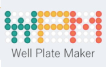

Présentation de **Thomas Burger**

Well Plate Maker: un petit outil bien commode pour la multi-omique clinique 

Vous trouverez le diaporama à ce lien : [pdf](/diapos/WPM_TB_2022.pdf).

Le lien vers la publication : https://doi.org/10.1093/bioinformatics/btab065
et celui vers le package Bioconductor **wpm** : https://bioconductor.org/packages/release/bioc/html/wpm.html .

<!-- 
 -->

<!-- 
 -->

{width=20%}